# SyntaxNodes - Image Processing Effects for ComfyUI

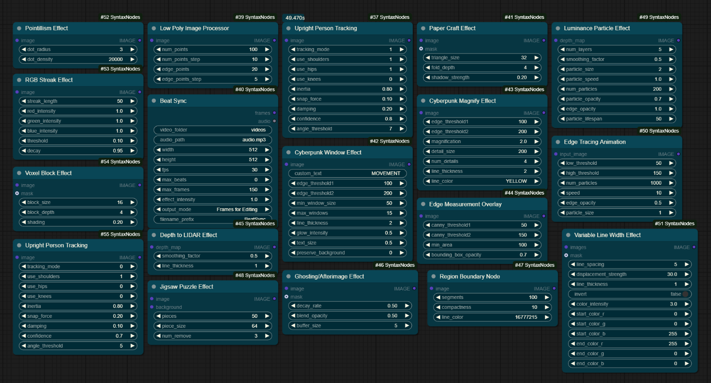 <!-- Replace with path to your overview image -->

A collection of custom nodes for ComfyUI designed to apply various image processing effects, stylizations, and analyses.

## Featured: Feedback Sampler (Prompt Scheduled)

A Deforum-style feedback sampler with built-in batch prompt scheduling and **full 4D and 5D latent support** — it works with classic image models (SD1.5, SDXL, Flux — `[B,C,H,W]` latents) *and* temporal/video-style models like Qwen and Wan (`[B,C,T,H,W]` latents). Zoom, rotation, and translation transforms preserve the channel/time axis order on 5D latents, so video-model feedback loops don't scramble frames. Built on [Adam Pizurny's FeedbackSampler](https://github.com/pizurny/Comfyui-FeedbackSampler). [Full documentation below.](#feedback-sampler-prompt-scheduled)


## Features

This pack includes the following nodes:

**Stylization & Effects:**

*   [Voxel Block Effect](#voxel-block-effect)
*   [RGB Streak Effect](#rgb-streak-effect)
*   [Cyberpunk Window Effect](#cyberpunk-window-effect)
*   [Cyberpunk Magnify Effect](#cyberpunk-magnify-effect)
*   [Variable Line Width Effect](#variable-line-width-effect)
*   [Jigsaw Puzzle Effect](#jigsaw-puzzle-effect)
*   [Low Poly Image Processor](#low-poly-image-processor)
*   [Pointillism Effect](#pointillism-effect)
*   [Paper Craft Effect](#paper-craft-effect)
*   [Ghosting/Afterimage Effect](#ghostingafterimage-effect)
*   [Luminance-Based Lines](#luminance-based-lines)
*   Pixel Scatter Effect

**Analysis & Visualization:**

*   [Edge Tracing Animation](#edge-tracing-animation)
*   [Edge Measurement Overlay](#edge-measurement-overlay)
*   [Luminance Particle Effect](#luminance-particle-effect)
*   [Depth to LIDAR Effect](#depth-to-lidar-effect)
*   [Region Boundary Node](#region-boundary-node)

**3D Gaussian Splatting:**

*   [SHARP 3D Gaussian Splat](#sharp-3d-gaussian-splat)
*   [Preview 3D Gaussian Splat](#preview-3d-gaussian-splat)
*   [Preview Gaussian Splat Video](#preview-gaussian-splat-video)
*   [Load Gaussian Splat](#load-gaussian-splat)
*   [Save Gaussian Splat](#save-gaussian-splat)

**Sampling & Animation:**

*   [Feedback Sampler (Prompt Scheduled)](#feedback-sampler-prompt-scheduled) — prompt-scheduled feedback animation with 4D & 5D latent support
*   [Prompt Travel KSampler](#prompt-travel-ksampler)
*   SD-CN Feedback Animation / SD-CN Feedback Animation (Audio Reactive)

**Utility & Synchronization:**

*   [Beat Sync](#beat-sync)
*   Beat Sync (Advanced)
*   Audio-Reactive Template
  

## Installation

1.  Navigate to your ComfyUI `custom_nodes` directory:
    *   `cd ComfyUI/custom_nodes/`
2.  Clone this repository:
    *   `git clone https://github.com/SyntaxDiffusion/ComfyUI-SyntaxNodes.git`
3.  Install the Python dependencies:
    *   `pip install -r ComfyUI-SyntaxNodes/requirements.txt`
4.  Restart ComfyUI.

*(to-do: Add instructions for installation via ComfyUI Manager.)*

## Nodes Reference

Below are details and examples for each node:

---

### Voxel Block Effect

Applies a 3D pixelated (voxel) effect to the image.

**Parameters:**
*   `image`: Input image.
*   `mask` (optional): Mask to limit the effect area.
*   `block_size`: Size of the voxel blocks.
*   `block_depth`: Depth simulation for the blocks.
*   `shading`: Amount of shading applied to simulate depth.

**Example:**
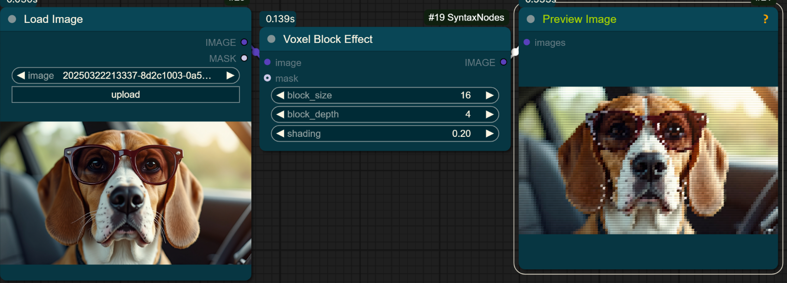 <!-- Replace with path to your example image -->

---

### RGB Streak Effect

Creates horizontal glitch-like streaks based on pixel brightness in RGB channels.

**Parameters:**
*   `image`: Input image.
*   `streak_length`: Maximum length of the streaks.
*   `red_intensity`, `green_intensity`, `blue_intensity`: Multiplier for streak length based on channel brightness.
*   `threshold`: Luminance threshold below which pixels won't generate streaks.
*   `decay`: How quickly streaks fade with distance.

**Example:**
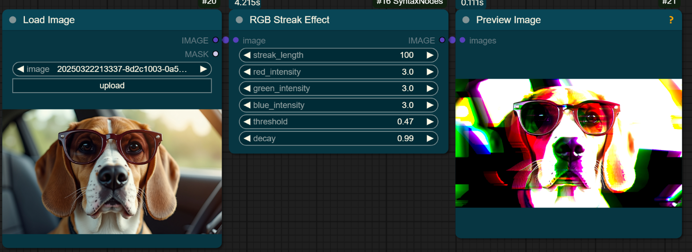 <!-- Replace with path to your example image -->

---

### Cyberpunk Window Effect

Overlays futuristic UI window elements onto detected edges or regions of interest.

**Parameters:**
*   `image`: Input image.
*   `custom_text`: Text to display within the windows.
*   `edge_threshold1`, `edge_threshold2`: Canny edge detection thresholds.
*   `min_window_size`: Minimum size for a detected window area.
*   `max_windows`: Maximum number of windows to draw.
*   `line_thickness`: Thickness of the window borders.
*   `glow_intensity`: Intensity of the outer glow effect (if any).
*   `text_size`: Size of the displayed text.
*   `preserve_background`: Whether to keep the original image visible (1) or use a black background (0).

**Example:**
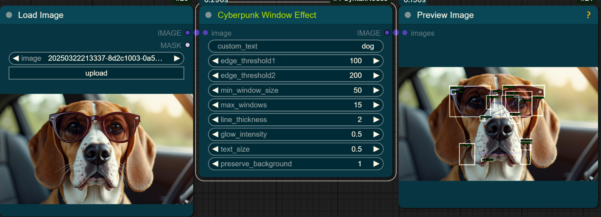 <!-- Replace with path to your example image -->

---

### Cyberpunk Magnify Effect

Creates magnified inset views ("detail windows") focusing on specific parts of the image, often highlighted by lines pointing to the original location.

**Parameters:**
*   `image`: Input image.
*   `edge_threshold1`, `edge_threshold2`: Canny edge detection thresholds (likely used to find points of interest).
*   `magnification`: Zoom factor for the detail windows.
*   `detail_size`: Size of the square detail windows.
*   `num_details`: Number of detail windows to generate.
*   `line_thickness`: Thickness of connecting lines and window borders.
*   `line_color`: Color of the connecting lines.

**Example:**
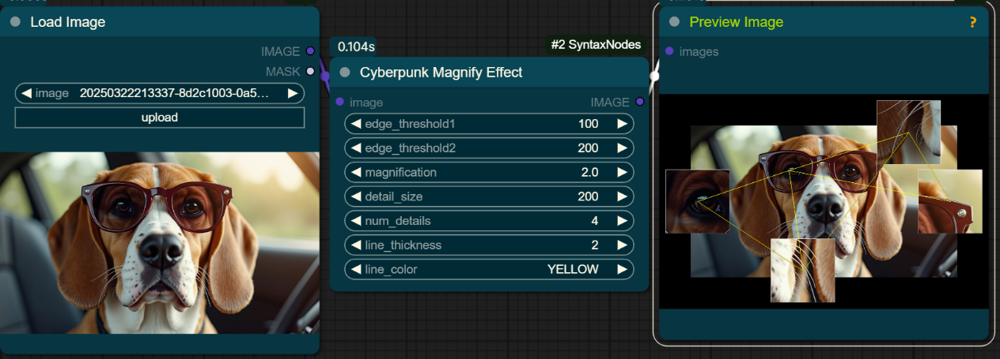 <!-- Replace with path to your example image -->

---

### Variable Line Width Effect

Draws horizontal lines across the image, displacing them vertically based on image content and varying color along the line.

**Parameters:**
*   `images`: Input image(s).
*   `mask` (optional): Mask to limit effect area.
*   `line_spacing`: Vertical distance between lines.
*   `displacement_strength`: How much image content affects vertical line position.
*   `line_thickness`: Thickness of the lines.
*   `invert`: Invert the displacement effect.
*   `color_intensity`: How strongly image color influences line color.
*   `start_color_r/g/b`: Starting color components for the gradient.
*   `end_color_r/g/b`: Ending color components for the gradient.

**Example:**
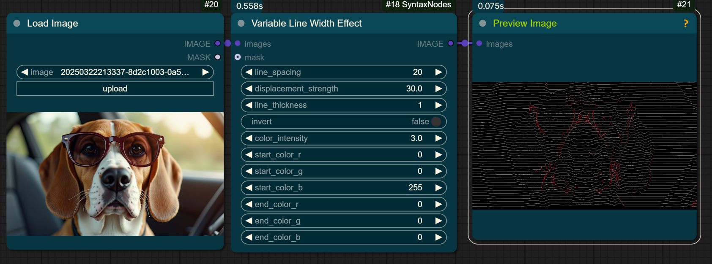 <!-- Replace with path to your example image -->

---

### Jigsaw Puzzle Effect

Transforms the image into a jigsaw puzzle grid, with options to remove pieces.

**Parameters:**
*   `image`: Input image.
*   `background` (optional): Image to use as background where pieces are removed.
*   `pieces`: Number of pieces along one dimension (total pieces = `pieces` * `pieces`).
*   `piece_size`: Size of each puzzle piece (may override `pieces` or work with it).
*   `num_remove`: Number of random pieces to remove.

**Example:**
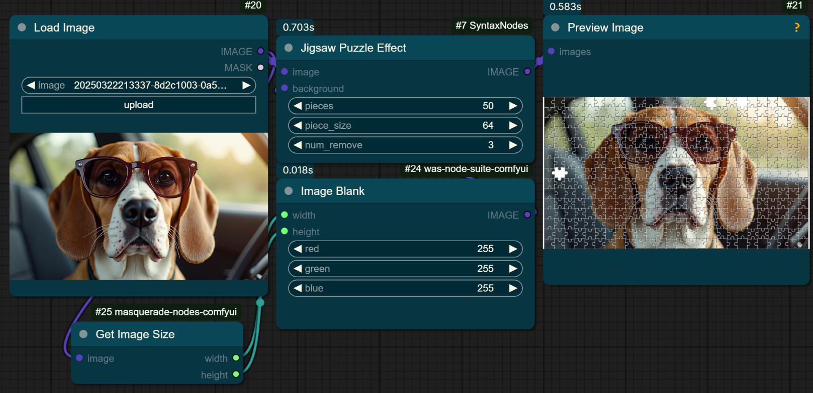 <!-- Replace with path to your example image -->

---

### Low Poly Image Processor

Converts the image into a stylized low-polygon representation using Delaunay triangulation.

**Parameters:**
*   `image`: Input image.
*   `num_points`: Number of initial points for triangulation.
*   `num_points_step`: Step related to point density or refinement.
*   `edge_points`: Number of points placed along detected edges.
*   `edge_points_step`: Step related to edge point density.

**Example:**
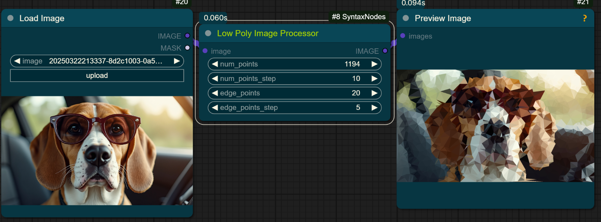 <!-- Replace with path to your example image -->

---

### Pointillism Effect

Recreates the image using small dots of color, mimicking the Pointillist art style.

**Parameters:**
*   `image`: Input image.
*   `dot_radius`: Radius of the individual dots.
*   `dot_density`: Number of dots to generate (higher means denser).

**Example:**
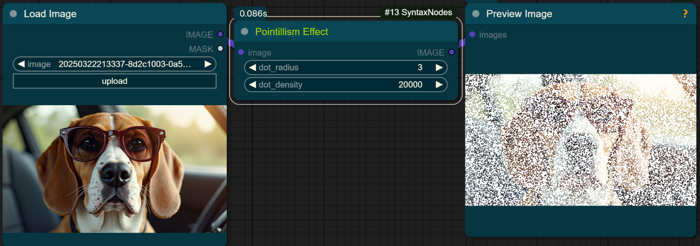 <!-- Replace with path to your example image -->

---

### Paper Craft Effect

Applies a filter that makes the image look like it's constructed from folded geometric triangles.

**Parameters:**
*   `image`: Input image.
*   `mask` (optional): Mask to limit the effect area.
*   `triangle_size`: Size of the triangular facets.
*   `fold_depth`: Intensity of the simulated folds/shading between triangles.
*   `shadow_strength`: Strength of the drop shadow effect.

**Example:**
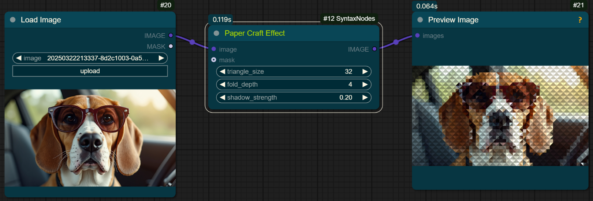 <!-- Replace with path to your example image -->

---

### Ghosting/Afterimage Effect

Creates trailing or faded copies of the image, simulating motion blur or afterimages.

**Parameters:**
*   `image`: Input image.
*   `mask` (optional): Mask to limit effect area.
*   `decay_rate`: How quickly the ghost images fade.
*   `offset`: Displacement of the ghost images.
*   `buffer_size`: Number of previous frames/states to use for ghosting.

**Example:**
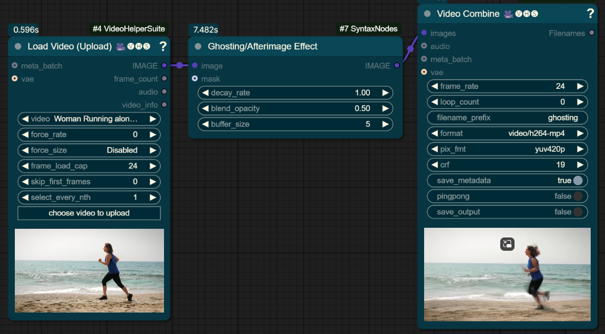 <!-- Replace with path to your example image -->


---

### Edge Tracing Animation

Visualizes image edges using animated particles that move along detected contours. *(Note: Example shows a static frame, animation occurs over time/frames)*.

**Parameters:**
*   `input_image`: Input image.
*   `low_threshold`, `high_threshold`: Canny edge detection thresholds.
*   `num_particles`: Total number of particles to simulate.
*   `speed`: Speed at which particles move along edges.
*   `edge_opacity`: Opacity of the underlying detected edges (if drawn).
*   `particle_size`: Size of the individual particles.
*   `particle_opacity`: Opacity of the particles.
*   `particle_lifespan`: How long each particle exists (relevant for animation).

**Example:**
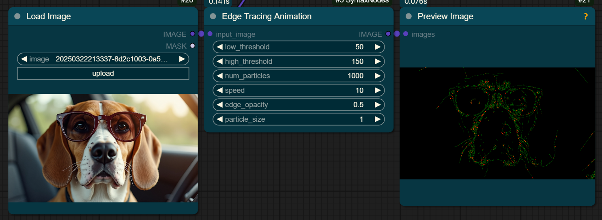 <!-- Replace with path to your example image -->

---

### Edge Measurement Overlay

Detects contours using Canny edge detection and draws bounding boxes around them.

**Parameters:**
*   `image`: Input image.
*   `canny_threshold1`, `canny_threshold2`: Canny edge detection thresholds.
*   `min_area`: Minimum area for a contour to be considered.
*   `bounding_box_opacity`: Opacity of the drawn bounding boxes.

**Example:**
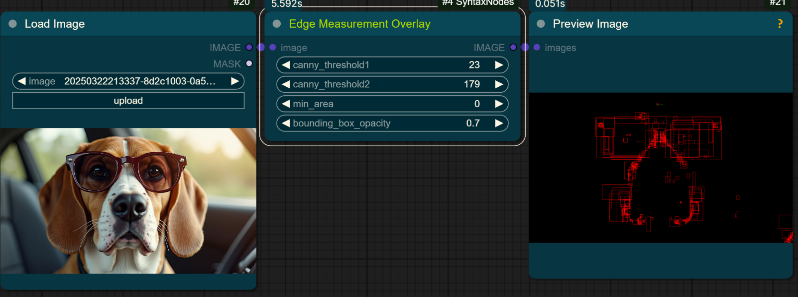 <!-- Replace with path to your example image -->

---

### Luminance Particle Effect

Generates particles whose distribution and possibly appearance are based on the luminance (brightness) of the input image/depth map.

**Parameters:**
*   `depth_map`: Input image (interpreted as brightness/depth).
*   `num_layers`: Number of depth layers for particle generation.
*   `smoothing_factor`: Smoothing applied to the input map.
*   `particle_size`: Size of the particles.
*   `particle_speed`: Speed factor (when used for a batch of image).
*   `num_particles`: Total number of particles.
*   `particle_opacity`: Opacity of the particles.
*   `edge_opacity`: Opacity for edge enhancement.
*   `particle_lifespan`: Duration particles exist (for animation).

**Example:**
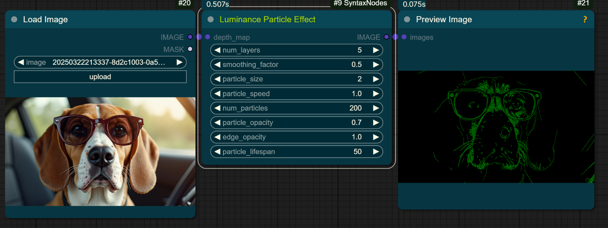 <!-- Replace with path to your example image -->

---

### Depth to LIDAR Effect

Quite literally a delay effect for edge detection. This is a WIP node that may change course over time, but in its current state simply takes a batch of images and provides a delay effect for its edge detection.

**Parameters:**
*   `depth_map`: Input depth map image batch (or batch of images).
*   `smoothing_factor`: Smoothing applied to the delay rate.
*   `line_thickness`: Thickness of the scan lines.

**Example:**
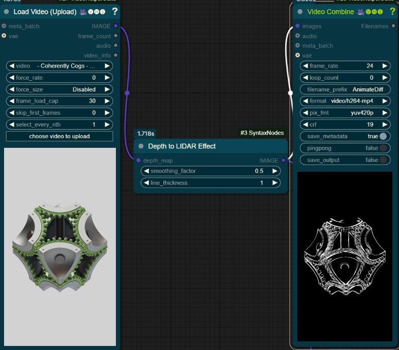 <!-- Replace with path to your example image -->

---

### Region Boundary Node

Segments the image into superpixels (regions of similar color/texture) using an algorithm like SLIC and draws the boundaries between them.

**Parameters:**
*   `image`: Input image.
*   `segments`: Target number of superpixel segments.
*   `compactness`: Balances color proximity vs. space proximity (higher means more square-like segments).
*   `line_color`: Color of the boundary lines (represented as an integer, likely BGR or RGB).

**Example:**
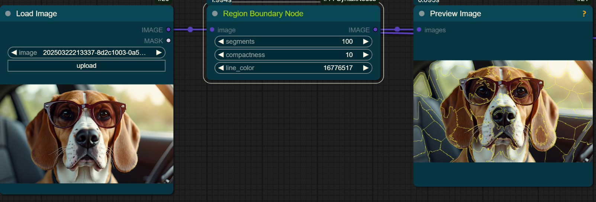 <!-- Replace with path to your example image -->

---

### Beat Sync

Input a folder of same resolution videos and an input audio, the script will auto process and return a automated, edited video based on your audio input.
Turn effect intensity to max for a stronger effect within the edit. 

**Parameters:**
*   **if you want to edit a few hundred frames within comfyui select "Frames for Editing", If youd like the entire song to process the selected video folder select "Direct Video Output", this will output the entire video into your Comfyui output folder with a  "BeatSync(timestamp).mp4 file extension.  *Note* VHS combine still needs to be plugged in for "Direct Video Output"
*   (This can be helpful to process 400 frames with other nodes within Comfyui vs processing a few thousand frames for a multi minute song)

**Example:**
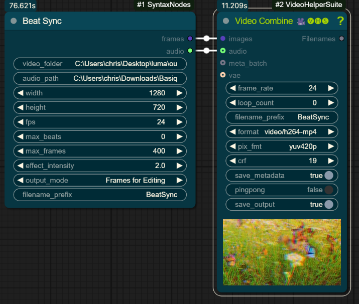 <!-- Replace with path to your example image -->


---

## Usage

1.  Load an image using a `Load Image` node or use an image output from another node.
2.  Add one of the `SyntaxNodes` (found under the "SyntaxNodes" category or by searching after right-clicking) to the canvas.
3.  Connect the `IMAGE` output from your source node to the `image` (or equivalent) input of the SyntaxNode.
4.  Adjust the parameters as needed. Check the node's tooltips in ComfyUI for specific parameter details.
5.  Connect the `IMAGE` output of the SyntaxNode to a `Preview Image` node or another processing node.

---

### SHARP 3D Gaussian Splat

Generates a 3D Gaussian Splat from a single image using Apple's SHARP model. Creates an interactive 3D scene that can be viewed and rendered as a flythrough video.

**Requirements:**
- [ml-sharp](https://github.com/apple/ml-sharp) - Apple's SHARP model (install with `pip install -e .` from the repo)
- [gsplat](https://github.com/nerfstudio-project/gsplat) - For video rendering (CUDA required)

**Important:** gsplat requires pre-built CUDA wheels for Windows. Install from:
```bash
pip install gsplat -f https://docs.gsplat.studio/whl/gsplat/
```
See all available wheels at: https://docs.gsplat.studio/whl/gsplat/

**Parameters:**
*   `image`: Input image to convert to 3D.
*   `focal_length_mm`: Focal length in mm (35mm equivalent). Default 30mm if unknown.
*   `output_filename`: Base filename for the output PLY file.
*   `render_video`: Whether to render a flythrough video (requires CUDA).
*   `video_frames`: Number of frames for the flythrough video.
*   `camera_path`: Camera trajectory type:
    - `rotate_forward` - Orbit around subject while pushing in (default)
    - `rotate` - Simple orbit around the subject
    - `swipe` - Side-to-side camera movement
    - `shake` - Small, subtle camera motion
*   `camera_distance`: Distance from subject (0 = auto based on scene).
*   `max_disparity`: Maximum parallax/3D effect strength.
*   `max_zoom`: Maximum zoom amount for rotate_forward path.
*   `loop_count`: Number of times to repeat the camera path.

**Outputs:**
*   `ply_path`: Path to the generated PLY file.
*   `video_path`: Path to the rendered flythrough video.
*   `preview_image`: Original input image for preview.

---

### Preview 3D Gaussian Splat

Interactive WebGL viewer for 3D Gaussian Splat PLY files. Displays the splat in a resizable 3D viewer embedded in the node.

**Controls:**
*   Drag to rotate
*   Scroll to zoom
*   Shift+drag to pan

**Parameters:**
*   `ply_path`: Path to the .ply Gaussian Splat file.

---

### Preview Gaussian Splat Video

Video player for Gaussian Splat flythrough videos. Displays the rendered MP4 video with playback controls.

**Parameters:**
*   `video_path`: Path to the rendered video file (.mp4).

---

### Load Gaussian Splat

Load a Gaussian Splat PLY file from the input/3d or output directory.

**Parameters:**
*   `ply_file`: Select from available PLY files.

**Outputs:**
*   `ply_path`: Full path to the selected PLY file.

---

### Save Gaussian Splat

Save/copy a Gaussian Splat PLY file with a custom name to the output directory.

**Parameters:**
*   `ply_path`: Path to the source PLY file.
*   `output_name`: Output filename (without extension).

**Outputs:**
*   `saved_path`: Path to the saved PLY file.

---

### Feedback Sampler (Prompt Scheduled)

A Deforum-style animation sampler that feeds each finished latent back into itself, with built-in FizzNodes-style batch prompt scheduling — no external BatchPromptSchedule node needed. Found under **SyntaxNodes/Sampling**. Built on [Adam Pizurny's Comfyui-FeedbackSampler](https://github.com/pizurny/Comfyui-FeedbackSampler).

**4D and 5D latent support:** all latent operations — zoom, 2D/3D rotation, translation, noise injection — handle both standard 4D image latents (`[batch, channels, height, width]`: SD1.5, SDXL, Flux, Krea) and 5D temporal latents (`[batch, channels, time, height, width]`: Qwen, Wan, and other video models). On 5D latents the temporal axis is explicitly moved alongside the batch axis before spatial transforms and restored afterwards, so channel and time data are never reinterpreted in the wrong order — feedback animation works on video-model latents the same way it does on image-model latents.

Each frame the previous output is transformed (zoom, rotation, translation) and re-sampled at a low denoise. Optional color matching, sharpening, and noise controls are available but default off so repeated frames stay in latent space without accumulating VAE or enhancement artifacts. Prompts can travel across frames via a schedule.

Works with variable-length text encoders (Qwen, Flux Krea, etc.) — conditioning is automatically padded to matching lengths, which stock FizzNodes scheduling does not handle.

Wan and other temporal VAEs are supported. Their decoded `T,H,W,C` frame layout is preserved during the enhancement round trip instead of being mistaken for a normal image batch.

**Prompt scheduling:** connect a `CLIP` and fill `prompt_schedule` using the FizzNodes format:

```
"0" :"a serene forest, morning light",
"60" :"a burning forest at dusk --neg smoke haze",
"120" :"a snowy forest at night"
```

Negative prompts can be embedded per-keyframe with `--neg`, or supplied as a separate `negative_prompt_schedule`. Alternatively, connect pre-built conditioning to `positive`/`negative` (static) or `positive_batch`/`negative_batch` (e.g. from FizzNodes) — the schedule inputs simply take priority when set.

Built-in schedules use normal linear conditioning interpolation for existing image-model modes. Krea2 is detected automatically and uses a short smoothstep transition near each keyframe instead of averaging its stacked Qwen hidden states across the full interval. Mixed conditioning is limited to the first 25% of active structural sampling; the remaining 75% snaps back to the nearest pure prompt for texture and detail. Outside transition frames no averaged conditioning is carried. Pre-built batch conditioning is always respected as supplied.

**Key Parameters:**
*   `model`, `seed`, `steps`, `cfg`, `sampler_name`, `scheduler`, `latent_image`, `denoise`: Standard KSampler parameters (frame 0 uses `denoise`, subsequent frames use `feedback_denoise`).
*   `iterations`: Number of frames to generate.
*   `feedback_denoise`: Denoise strength for diffused feedback frames — lower preserves more of the previous frame. Zoom-in and zoom-out both re-diffuse the full transformed frame at this value.
*   `frame_cadence`: Deforum-style diffusion cadence. `1` diffuses every frame (the existing behavior); `2+` diffuses interval keyframes while motion-transforming intermediate frames without a sampler pass.
*   `seed_variation`: `fixed`, `increment`, or `random` seed per frame.
*   `zoom_value`, `angle`, `translation_x/y/z`, `rotation_3d_x/y/z`: Static per-frame motion. Each has a matching `*_schedule` string input (`"0:(0.0), 60:(0.1)"`) that overrides the static value with keyframed motion.
*   `color_coherence` / `color_coherence_strength`: Histogram matching (`LAB`/`RGB`/`HSV`) against the first frame to stop color bleeding. Requires a `vae`.
*   `noise_amount` / `noise_type`, `sharpen_amount`, `contrast_boost`: Detail-retention enhancements applied in pixel space each frame.
*   `lumina_mode`, `temporal_smoothing`, `cond_blend_strength`: Smoothing presets/controls for reduced flicker (tuned for Lumina/zImage-style models).
*   `mask`: Optional user-controlled mask (single or batch) restricting which areas get re-diffused each frame. Zoom-out does not create an automatic outpaint mask.

**Outputs:**
*   `final_latent`: The last generated frame.
*   `all_latents`: All frames as a latent batch, ready for VAE decode and video combine.

*Batch mode:* feeding a latent batch (batch > 1) processes each input latent once through the feedback chain instead of looping on a single latent.

During execution, the node uses one sequence-wide progress bar, keeps ComfyUI's live latent preview active during every diffusion pass, pushes a preview after each completed frame, and displays a rolling ETA after the first frame completes. These updates are display-only and do not alter sampler inputs or results.

For a clean starting point, use `zoom_value=0.005`, `feedback_denoise=0.3`, `seed_variation=fixed`, `color_coherence=None`, `noise_amount=0`, `sharpen_amount=0`, and `contrast_boost=1.0`. Enable pixel-space enhancements only when they solve a visible problem, since every VAE round trip can accumulate softness or noise over a long sequence.

---

### Prompt Travel KSampler

An all-in-one prompt travel sampler under **SyntaxNodes/Sampling**. Enter any number of prompts separated by `|` and it handles CLIP encoding, SLERP noise interpolation between keyframes, and LERP conditioning interpolation internally, outputting a latent batch ready for VAE decode → video.

```
a beautiful sunrise over mountains | a bright noon sky | a golden sunset | a starry night
```

**Key Parameters:**
*   `model`, `clip`, `vae`, `seed`, `steps`, `cfg`, `sampler_name`, `scheduler`, `denoise`: Standard sampling parameters.
*   `prompts`: Prompts separated by `|` — as many as you want.
*   `negative_prompt`: Applied to all frames.
*   `width` / `height`: Output resolution. Latent channel count and downscale ratio are derived from the model/VAE, so 16-channel models (Flux, Krea, SD3) work out of the box.
*   `frames_per_transition`: Frames generated between each pair of prompts.
*   `interpolation_mode`: `slerp` (spherical, smoother) or `lerp` (linear).
*   `loop`: Loop back to the first prompt at the end for seamless cycles.

**Output:** `latent_batch` — one latent per frame across all transitions.

---

## Credits

*   **[FizzNodes](https://github.com/FizzleDorf/ComfyUI_FizzNodes)** by FizzleDorf — the batch prompt scheduling in this pack (schedule parsing, prompt interpolation, and batch conditioning in `syntax_schedule/`) is ported from FizzNodes' BatchPromptSchedule, with added support for variable-length text encoders. These nodes in turn build on the [Deforum](https://github.com/deforum-art/sd-webui-deforum) A1111 extension.
*   **[Comfyui-FeedbackSampler](https://github.com/pizurny/Comfyui-FeedbackSampler)** by Adam Pizurny — the original standalone FeedbackSampler that the Feedback Sampler (Prompt Scheduled) node is built from.

---

## Contributing

Contributions are welcome! Please feel free to submit pull requests or open issues for bugs, feature requests, or improvements.
